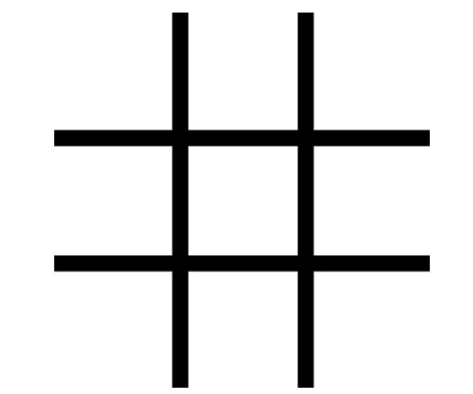

  
   

# 📖 [TIC-TAC_TOE] 

**[TIC TAC TOE]** is the clasic game of tic tac toe that you can play in your browser. 

## Requierements 

-This project is part of The Odin's Project curriculum
   -Main Requierements:
  1. You’re going to store the gameboard as an array inside of a Gameboard object
  2. Add a t function that will render the contents of the gameboard array to the webpage
  4. Build the functions that allow players to add marks to a specific spot on the board, and then tie it to the DOM, letting players click on the gameboard to place their marker
  5. Build the logic that checks for when the game is over!

## 🛠 Built With 

### Tech Stack 

> Javascript
> CSS
>HTML

### Key Features 

- **Totally responsive for mobiles, tablets and desktops**
- **Game to play with an opponent**
- **Modal pop up when the game finish.**

## 🚀 Live Demo 

> Here you can see the live demo of my project:

- [Live Demo Link](https://rivasbolinga.github.io/Tic-Tac-Toe/)

👤 **Andrea Rivas Palacios**

- GitHub: [@rivasbolinga](https://github.com/rivasbolinga)
- Twitter: [@AndreaRivasPal](https://twitter.com/AndreaRivasPal)

## 🔭 Future Features 

> Cooming soon...

- [ ] **[Create an AI as oponent]**
- [ ] **[Clean up the interface to allow players to put in their names, include a button to start/restart the game and add a display element that congratulates the winning player!]**

<!-- SUPPORT -->
## ⭐️ Show your support 

<!-- > Write a message to encourage readers to support your project -->
Give a ⭐️ if you like this project!
